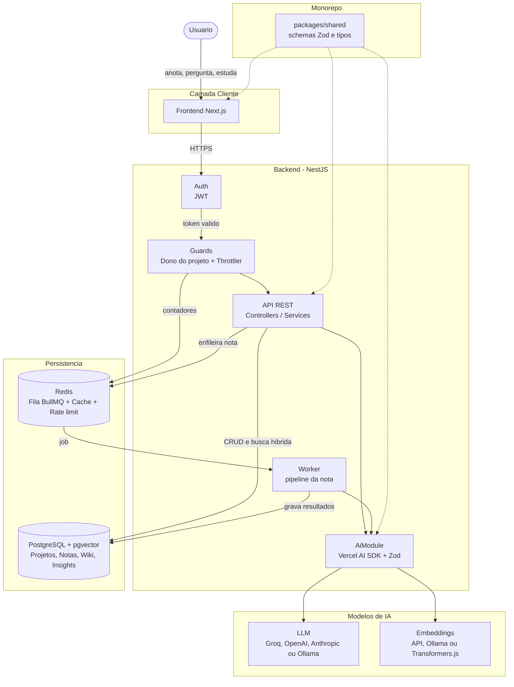
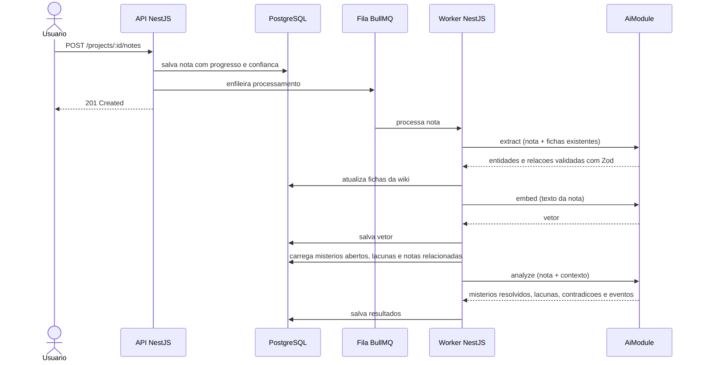
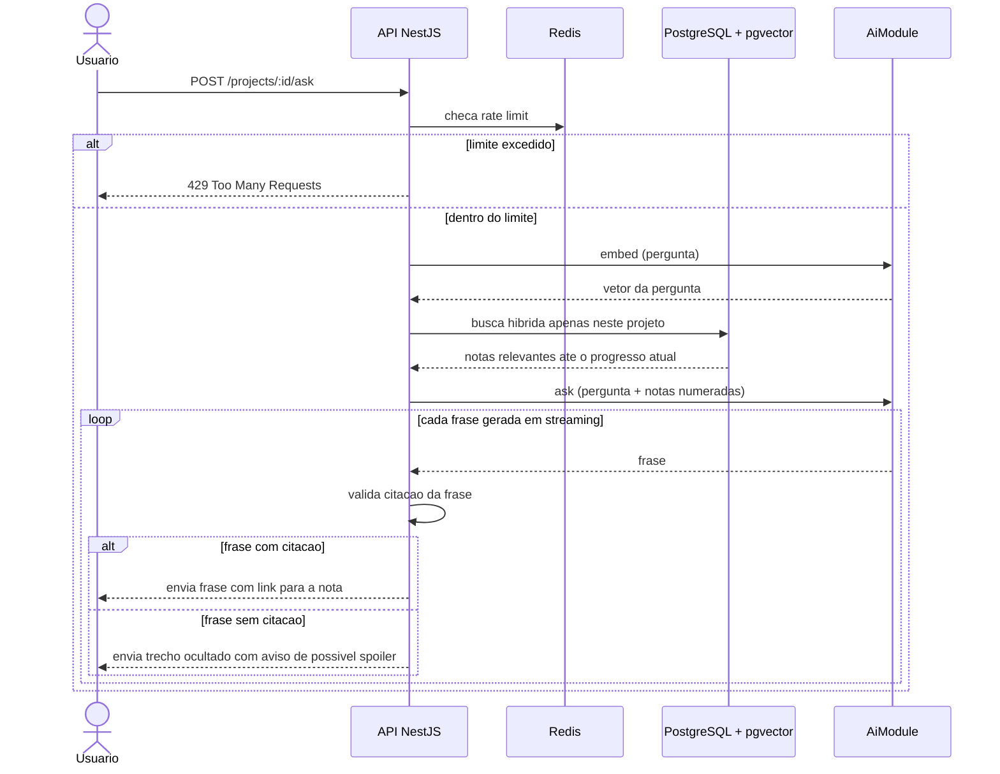
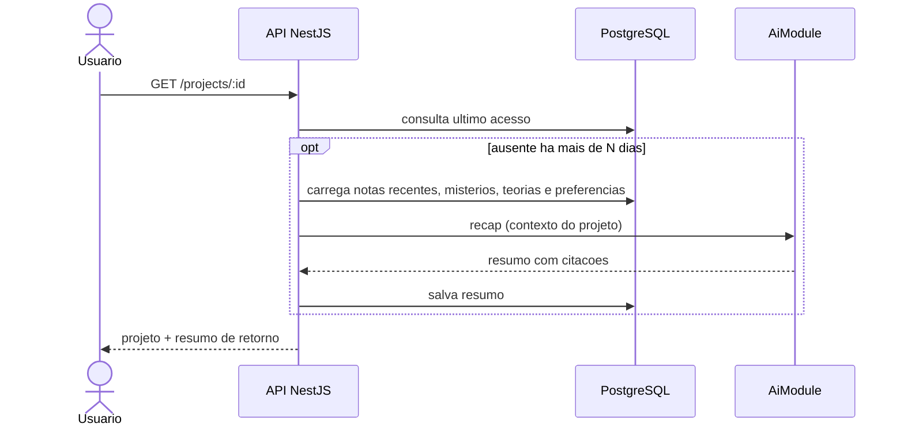

# BOOKMARK — O Anotador de Lacunas

BOOKMARK é uma plataforma de anotações com IA para quem está aprendendo algo com muita coisa para lembrar: a história de um jogo, a trama de um livro ou o conteúdo de uma matéria. O usuário anota o que descobre, e o sistema organiza, conecta e analisa essas anotações usando **LLM, embeddings e RAG**, montando uma **wiki pessoal**, apontando **lacunas** no que ele sabe, levantando **teorias** e ajudando a **memória de longo prazo**. Tudo isso **sem spoilers**: o Bookmark só sabe o que o próprio usuário descobriu.

O projeto é **100% TypeScript**, organizado em monorepo: **backend em NestJS**, **frontend em Next.js** e a IA (LLM, embeddings e análise) integrada ao backend através do **Vercel AI SDK**. Os dados ficam em PostgreSQL com pgvector para a busca vetorial, e uma fila em Redis processa as anotações em segundo plano.

> **Status:** em desenvolvimento · feito para rodar localmente com Docker ([como rodar](#como-rodar))

## Objetivos

* Permitir que o usuário anote livremente o que descobre, sem precisar organizar nada.
* Transformar anotações soltas em uma wiki pessoal, com fichas geradas automaticamente.
* Apontar lacunas, contradições e mistérios em aberto para orientar o que investigar ou revisar.
* Gerar teorias sobre o que pode acontecer ou o que pode ter acontecido, sempre baseadas nas anotações e rotuladas como especulação.
* Ajudar a memória de longo prazo com resumos de retorno e revisão espaçada.
* Garantir zero spoiler por construção: a IA responde apenas com base no que o usuário anotou.
* Funcionar para qualquer tipo de aprendizado: livros, histórias de jogos, estudos e o que mais o usuário quiser.

---

## Os Três Pilares do Produto

### 1. Caderno de Descobertas
O usuário cria um projeto com um título (por exemplo, "Elden Ring", "Duna" ou "Cálculo 1"), escolhe o tipo e, se quiser, descreve o que está aprendendo. A partir daí, é só anotar. Cada anotação pode ter um **marcador de progresso** (capítulo, sessão de jogo, aula) e um **nível de confiança**: **fato** (vi com meus olhos), **suspeita** (acho que é isso) ou **boato** (alguém me contou). Personagens mentem e narradores enganam, e essa distinção deixa a análise muito mais rica.

### 2. Wiki Viva e Análise
A cada anotação, a IA identifica personagens, lugares, itens, eventos ou conceitos e mantém uma ficha para cada um, com links para as notas de origem. Sobre essa base, o Bookmark:
* aponta **lacunas** ("você sabe que X é filho de Y, mas nunca anotou nada sobre a mãe");
* mantém uma lista de **mistérios em aberto** e avisa quando uma nota nova pode ter resolvido algum;
* detecta **contradições**, como um boato desmentido por um fato;
* levanta **teorias** e reúne evidências a favor e contra;
* organiza **duas linhas do tempo**: a ordem em que você descobriu as coisas e a ordem cronológica da história;
* desenha um **mural de investigação**, um grafo que liga as entidades como num quadro de detetive.

### 3. Memória de Longo Prazo
Ao voltar para um projeto depois de dias parado, o usuário recebe um resumo no estilo **"Da última vez em..."**, com o que tinha descoberto e as dúvidas que estavam em aberto. No **modo estudo**, o Bookmark gera flashcards e quizzes a partir das próprias notas, com revisão espaçada, e oferece o **modo Feynman**: o usuário explica um conceito com as próprias palavras e a IA compara com o que ele anotou, apontando o que ficou faltando.

---

## Um App, Vários Usos

| | Livro | História de jogo | Estudos |
| :--- | :--- | :--- | :--- |
| **Exemplo de nota** | "Paul teve uma visão com o deserto de novo" | "A descrição da espada fala de um cavaleiro que traiu a ordem" | "Derivada é a taxa de variação instantânea" |
| **Progresso** | Capítulo | Sessão ou região do mapa | Aula ou módulo |
| **Entidades** | Personagens, casas, lugares | NPCs, itens, regiões, facções | Conceitos, fórmulas, autores |
| **Lacunas típicas** | Parentescos e motivações | Origem de itens e facções | Conceitos sem exemplo ou sem conexão |
| **Destaque** | Linha do tempo e fichas | Mural de investigação e mistérios | Modo estudo e revisão espaçada |

---

## O Princípio Anti-Spoiler

**O Bookmark só sabe o que você descobriu.** A base de conhecimento são as anotações do usuário, nada mais. Como modelos de linguagem já conhecem muitas obras famosas, a proteção é feita em camadas:

1. **Busca restrita.** O RAG recupera apenas notas do projeto atual, respeitando o marcador de progresso.
2. **Instruções rígidas.** O modelo é orientado a responder somente com base nas notas fornecidas e a dizer "você ainda não descobriu isso" quando a informação não estiver nelas.
3. **Citação obrigatória.** Toda afirmação precisa apontar para a nota de origem. O backend valida a citação de cada frase antes de enviá-la ao frontend. Uma frase sem citação é ocultada e sinalizada como possível conhecimento externo, e o usuário decide se quer revelar.
4. **Teorias rotuladas.** Toda teoria gerada é marcada como especulação e mostra em quais notas se baseia.
5. **Avaliações automáticas.** Um conjunto de testes anti-spoiler roda antes de qualquer mudança em prompts ou na busca (ver [Testes](#testes)).

Nenhuma camada é infalível sozinha. Por isso a transparência das citações é parte central da experiência.

---

## Motor de IA

A IA roda dentro do próprio backend, em um módulo dedicado (`AiModule`) construído com o **Vercel AI SDK**. Nenhum outro módulo fala diretamente com os provedores de IA: todos passam pelo `AiModule`, que funciona como uma fronteira bem definida. Se um dia for preciso separar a IA em um serviço próprio, basta extrair esse módulo.

O `AiModule` não acessa o banco de dados. Os services montam o contexto de cada tarefa (notas relevantes, fichas, mistérios abertos, preferências do usuário) e passam para ele, que devolve o resultado. Assim, toda a regra de acesso aos dados, incluindo o isolamento entre usuários, fica fora da IA.

* Provedor configurável: Groq, OpenAI, Anthropic ou modelos locais via Ollama.
* Respostas estruturadas validadas com schemas **Zod** compartilhados no monorepo (`packages/shared`), os mesmos usados pelo frontend e pela validação da API.
* Embeddings via AI SDK (provedor externo ou Ollama) ou localmente com **Transformers.js**. Como as notas são em português, a escolha deve ser um modelo multilíngue (no caso do Transformers.js, com versão em ONNX).
* Respostas das perguntas enviadas em **streaming por frase**: cada frase só chega ao frontend depois que a citação dela é validada.
* As chaves dos provedores ficam apenas nas variáveis de ambiente do backend.

### Operações do AiModule

| Operação | Quando roda | O que produz |
| :--- | :--- | :--- |
| `extract` | A cada nota (worker) | Entidades e relações para a wiki |
| `embed` | A cada nota (worker) e a cada pergunta | Vetores salvos ou usados na busca no pgvector |
| `analyze` | A cada nota (worker) | Mistérios possivelmente resolvidos, novas lacunas, contradições e eventos da linha do tempo |
| `ask` | Sob demanda | Resposta em streaming com citações das notas |
| `theories` | Sob demanda | Teorias rotuladas como especulação, com evidências |
| `recap` | Ao reabrir um projeto após ausência | Resumo "Da última vez em..." |
| `study` | Sob demanda | Flashcards, quizzes e avaliação no modo Feynman |
| `visionText` | Sob demanda | Texto extraído de um print, que vira anotação |

### Memória em três camadas

| Camada | O que guarda | Onde vive |
| :--- | :--- | :--- |
| **Usuário** | Preferências de estudo, nível de detalhe e tom das respostas | `user_memory` |
| **Projeto** | Entidades, relações, lacunas, mistérios, teorias e linha do tempo | Tabelas do projeto |
| **Sessão** | A conversa atual com o assistente | Memória de curto prazo, não persistida |

Todas as camadas vivem no PostgreSQL e são passadas ao `AiModule` quando necessário.

### Busca híbrida
A busca é executada no PostgreSQL. O texto da pergunta é convertido em vetor pelo `AiModule`, e a **busca vetorial** (pgvector) é combinada com a **busca por palavra-chave** (full-text search do PostgreSQL). Nomes próprios inventados, muito comuns em livros e jogos, são um ponto fraco dos embeddings, e a busca textual cobre essa falha. Como anotações costumam ser curtas, **cada nota é uma unidade de busca inteira**, sem fatiamento, o que mantém as citações precisas.

### Saída estruturada
Tarefas como extração de entidades e análise da nota pedem ao modelo uma resposta em formato estruturado, validada com **Zod** antes de ser gravada no banco. Se a validação falhar, o job volta para a fila e é reprocessado.

> **Nota:** trocar o modelo de embeddings exige reprocessar os vetores de todas as notas, já que vetores de modelos diferentes não são comparáveis entre si.

---

## MVPs do Produto

O desenvolvimento é dividido em três entregas, começando pelo núcleo (anotar, buscar e organizar) e só depois partindo para a análise e as ferramentas de estudo.

### MVP 1 — Caderno, Busca e Wiki
* Autenticação e perfil do usuário.
* Projetos com título, tipo, contexto e progresso atual.
* Anotações com marcador de progresso e nível de confiança.
* Embeddings, busca híbrida e perguntas respondidas com citação.
* Extração de entidades e wiki automática.
* Rate limiting nas rotas de IA.

### MVP 2 — Análise e Memória
* Anotador de lacunas e detecção de contradições.
* Mistérios em aberto, com aviso de possível resolução.
* Teorias do usuário e da IA, com evidências a favor e contra.
* Duas linhas do tempo.
* Resumo "Da última vez em...".
* Memória do usuário (preferências).

### MVP 3 — Estudo e Visual
* Modo estudo: flashcards, quizzes e revisão espaçada.
* Modo Feynman.
* Mural de investigação.
* Captura por imagem (um print vira anotação).
* Exportação da wiki em Markdown.

---

## Arquitetura

### Visão geral dos componentes



### Fluxo de uma nova anotação



### Fluxo de pergunta com proteção anti-spoiler



### Fluxo de retorno ao projeto ("Da última vez em...")



### Arquitetura Modular do Backend (padrão NestJS)

O backend segue a **arquitetura modular padrão do NestJS**, com cada domínio em um módulo independente e o padrão **Controller → Service → Prisma**:

* O **Controller** recebe a requisição HTTP, valida o DTO e chama o Service. Não tem regra de negócio.
* O **Service** concentra a regra de negócio e acessa o banco via Prisma.
* O **Module** declara e conecta tudo, e é importado pelo `AppModule`.
* A IA é acessada apenas pelo `AiModule`, que isola o resto do backend dos provedores.

| Módulo | Responsabilidade |
| :--- | :--- |
| `AuthModule` | Autenticação e validação de JWT |
| `ProjectsModule` | Projetos, progresso e resumo de retorno |
| `NotesModule` | Anotações e enfileiramento do processamento |
| `WikiModule` | Entidades, fichas e relações |
| `InsightsModule` | Lacunas, mistérios, contradições, teorias e linha do tempo |
| `SearchModule` | Busca híbrida e perguntas com citação |
| `StudyModule` | Flashcards, quizzes, revisão espaçada e modo Feynman |
| `AiModule` | LLM e embeddings via Vercel AI SDK. Único ponto do backend que fala com os provedores de IA |
| `QueueModule` | Fila BullMQ e processadores do worker, que rodam em processo separado da API |

---

## Stack Tecnológica

| Camada | Tecnologia |
| :--- | :--- |
| Linguagem | **TypeScript em todo o projeto**, em monorepo com npm workspaces + Turborepo |
| Backend | Node.js, NestJS, Passport (JWT), Swagger (`@nestjs/swagger`) |
| ORM | Prisma (consultas vetoriais em SQL parametrizado) |
| Persistência | PostgreSQL + pgvector |
| Fila / Cache / Rate limit | Redis, BullMQ, `@nestjs/throttler` |
| Validação | Zod, com schemas compartilhados em `packages/shared` (nestjs-zod nos DTOs) |
| LLM | Vercel AI SDK, com provedor configurável (Groq, OpenAI, Anthropic ou Ollama) |
| Embeddings | Vercel AI SDK (API ou Ollama) ou Transformers.js (local), com modelo multilíngue |
| Frontend | Next.js, React Flow (mural de investigação), AI SDK UI (streaming das respostas) |
| Testes | Jest (padrão do NestJS) e promptfoo (avaliações anti-spoiler) |
| Infraestrutura | Docker e Docker Compose (Postgres, Redis, API, worker, web e Ollama opcional), tudo rodando localmente |

---

## Modelo de Dados (proposta inicial)

| Tabela | Campos principais | Observações |
| :--- | :--- | :--- |
| `users` | id, email, senha_hash, nome, criado_em | Senha guardada como hash (bcrypt) e autenticação com JWT emitido pelo próprio backend |
| `user_memory` | id, user_id, preferencias, atualizado_em | Camada de memória do usuário |
| `projects` | id, user_id, titulo, tipo, contexto, progresso_atual, ultimo_acesso, criado_em | `tipo`: LIVRO, JOGO, ESTUDO, OUTRO |
| `notes` | id, project_id, conteudo, progresso, confianca, embedding, processada, criado_em | `confianca`: FATO, SUSPEITA, BOATO. `embedding`: vetor pgvector |
| `entities` | id, project_id, nome, tipo, resumo, atualizado_em | Fichas da wiki (personagem, lugar, item, evento, conceito) |
| `note_entities` | note_id, entity_id | Em quais notas cada entidade aparece |
| `entity_relations` | id, entity_a_id, entity_b_id, tipo, note_id | Base do mural de investigação |
| `gaps` | id, project_id, entity_id, descricao, status, criado_em | `status`: ABERTA, PREENCHIDA, IGNORADA |
| `mysteries` | id, project_id, pergunta, status, resolvido_por_note_id | `status`: ABERTO, POSSIVELMENTE_RESOLVIDO, RESOLVIDO |
| `contradictions` | id, project_id, note_a_id, note_b_id, descricao, status | Ex.: boato desmentido por um fato |
| `theories` | id, project_id, enunciado, origem, status | `origem`: USUARIO ou IA. Sempre rotulada como especulação |
| `theory_evidence` | theory_id, note_id, posicao | `posicao`: A_FAVOR ou CONTRA |
| `timeline_events` | id, project_id, note_id, descricao, ordem_descoberta, ordem_cronologica | Base das duas linhas do tempo |
| `recaps` | id, project_id, conteudo, gerado_em | Resumos "Da última vez em..." |
| `flashcards` | id, project_id, note_id, frente, verso, intervalo, facilidade, proxima_revisao | Revisão espaçada (algoritmo SM-2) |

---

## API

Padrão REST, versionada em `/api/v1`, com documentação automática via Swagger em `/api/docs`.

### Autenticação
```text
POST   /api/v1/auth/register
POST   /api/v1/auth/login
POST   /api/v1/auth/refresh
```

### Usuário
```text
GET    /api/v1/users/me
PATCH  /api/v1/users/me/preferences          # memoria do usuario (estilo de estudo, nivel de detalhe)
DELETE /api/v1/users/me                      # exclusao completa dos dados (LGPD)
```

### Projetos
```text
GET    /api/v1/projects
POST   /api/v1/projects
GET    /api/v1/projects/:id                  # inclui o resumo "Da ultima vez em..." quando aplicavel
PATCH  /api/v1/projects/:id
PATCH  /api/v1/projects/:id/progress         # atualiza o progresso atual
DELETE /api/v1/projects/:id
GET    /api/v1/projects/:id/export           # exporta a wiki em Markdown
```

### Anotações
```text
POST   /api/v1/projects/:id/notes            # salva e enfileira o processamento
GET    /api/v1/projects/:id/notes
PATCH  /api/v1/notes/:id
DELETE /api/v1/notes/:id
POST   /api/v1/projects/:id/notes/image      # captura por imagem (MVP 3, rate limited)
```

### Perguntas
```text
POST   /api/v1/projects/:id/ask              # resposta com citacoes das notas (rate limited)
```

### Wiki
```text
GET    /api/v1/projects/:id/entities
GET    /api/v1/entities/:id                  # ficha com as notas de origem
GET    /api/v1/projects/:id/graph            # dados do mural de investigacao
```

### Análise
```text
GET    /api/v1/projects/:id/gaps
PATCH  /api/v1/gaps/:id                      # marca como preenchida ou ignorada
GET    /api/v1/projects/:id/mysteries
POST   /api/v1/projects/:id/mysteries        # usuario registra um misterio
PATCH  /api/v1/mysteries/:id
GET    /api/v1/projects/:id/contradictions
GET    /api/v1/projects/:id/theories
POST   /api/v1/projects/:id/theories         # usuario registra uma teoria
POST   /api/v1/projects/:id/theories/generate  # IA sugere teorias (rate limited)
GET    /api/v1/projects/:id/timeline?order=discovery|chronological
```

### Estudo
```text
GET    /api/v1/projects/:id/flashcards/due   # cartoes com revisao pendente
POST   /api/v1/flashcards/:id/review         # registra o resultado e agenda a proxima revisao
POST   /api/v1/projects/:id/quiz             # gera quiz a partir das notas
POST   /api/v1/projects/:id/feynman          # avalia a explicacao do usuario
```

---

## Segurança e Privacidade

* **Isolamento de dados:** todo acesso passa por um guard que verifica se o projeto pertence ao usuário, e toda consulta, inclusive a busca 